# Architecture

How this backend is put together: what owns what, how a request flows, what the
schema looks like, and the exact order the Fintech Primitives (FP) calls have to
happen in.

Companion documents:
- [`README.md`](README.md) — setup, environment, and the sandbox findings
- [`CLAUDE.md`](CLAUDE.md) — the rules to follow when changing this code
- [`prisma/schema.prisma`](prisma/schema.prisma) — the schema itself, commented

---

## 1. System context

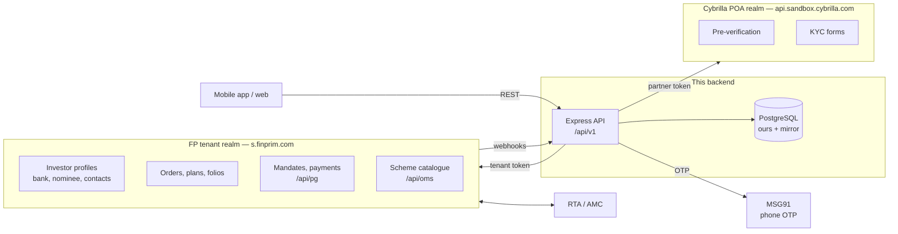
```mermaid
flowchart LR
    App["Mobile app / web"]

    subgraph Backend["This backend"]
        API["Express API<br/>/api/v1"]
        DB[("PostgreSQL<br/>ours + mirror")]
    end

    subgraph FPTenant["FP tenant realm — s.finprim.com"]
        Profiles["Investor profiles<br/>bank, nominee, contacts"]
        Orders["Orders, plans, folios"]
        Pay["Mandates, payments<br/>/api/pg"]
        Cat["Scheme catalogue<br/>/api/oms"]
    end

    subgraph FPPartner["Cybrilla POA realm — api.sandbox.cybrilla.com"]
        PV["Pre-verification"]
        KF["KYC forms"]
    end

    MSG91["MSG91<br/>phone OTP"]
    RTA["RTA / AMC"]

    App -->|REST| API
    API --> DB
    API -->|tenant token| FPTenant
    API -->|partner token| FPPartner
    API -->|OTP| MSG91
    FPTenant -->|webhooks| API
    FPTenant <--> RTA
```

Two things follow from this picture and drive every design decision below.

**FP is the system of record.** Investor identity, KYC, folios, orders,
mandates and payments live in FP. This database holds our own tables plus a
*mirror* of FP's objects. We never invent a mirrored row's state.

**There are two FP realms with different credentials.** The tenant realm serves
the object APIs; the Cybrilla POA realm serves pre-verification and KYC forms
and rejects the tenant token (and vice versa — the partner token is refused by
every v2 API with *"Partner tokens are not allowed"*). The transport picks the
realm per call.

---

## 2. Who owns which data

| | Models | Source of truth |
|---|---|---|
| **Ours** | `User`, `UserInvestorProfile`, `InvestorOnboarding`, `PhoneVerification`, `WatchlistItem`, `AuditLog`, `FpWebhookEvent` | this database |
| **Mirror** | everything carrying an `fpId` | FP |

Rules for the mirrored half — these are not style preferences, they are what
keeps the mirror convergent:

| Rule | Why |
|---|---|
| Upsert on `fpId`, never insert blind | The same object arrives twice — once from the API response, once from the webhook |
| `fpOldId` is not redundant | The Payments and Mandates APIs address purchases and bank accounts by that legacy **integer**, not the `fpId` string |
| Never invent state locally | A mirrored row changes only when FP says so |
| `syncedAt` on every mirror row | Makes a stale projection detectable rather than silently wrong |
| Holdings come from FP's report only | Allotment happens at the AMC net of stamp duty — summing our own order rows gives the wrong number |

---

## 3. Layers

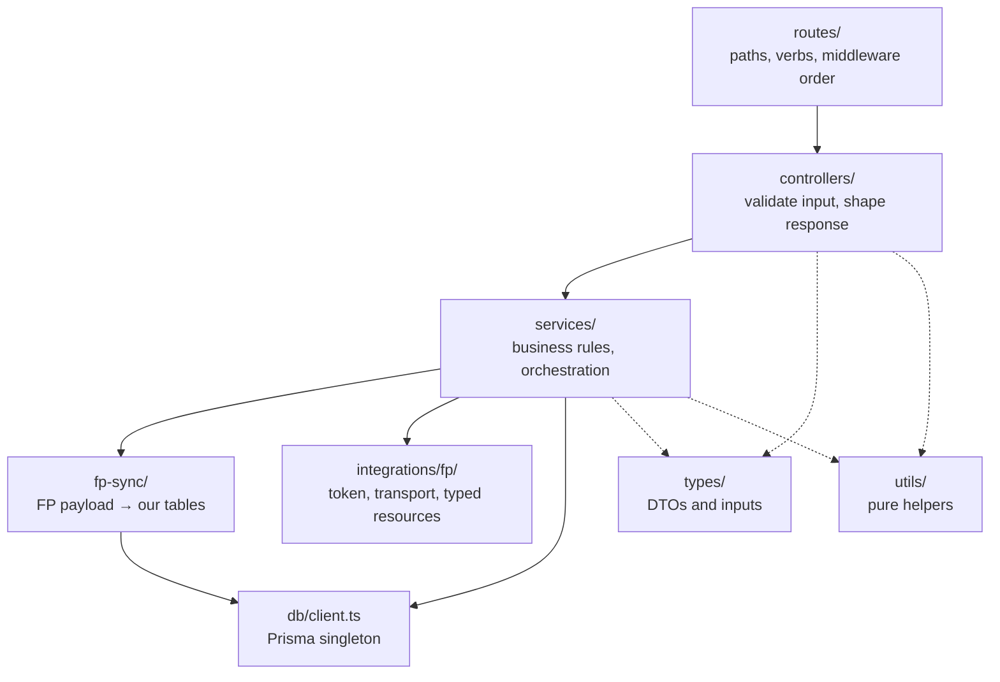
```mermaid
flowchart TD
    R["routes/<br/>paths, verbs, middleware order"]
    C["controllers/<br/>validate input, shape response"]
    S["services/<br/>business rules, orchestration"]
    Y["fp-sync/<br/>FP payload → our tables"]
    I["integrations/fp/<br/>token, transport, typed resources"]
    D["db/client.ts<br/>Prisma singleton"]
    U["utils/<br/>pure helpers"]
    T["types/<br/>DTOs and inputs"]

    R --> C --> S
    S --> Y --> D
    S --> I
    S --> D
    C -.-> T
    S -.-> T
    C -.-> U
    S -.-> U
```

Dependency direction is one-way. A service that imports `express` is wrong; a
controller that imports `db` is wrong; `utils/` stays pure. Fix the layering
rather than adding an exception.

### Request lifecycle

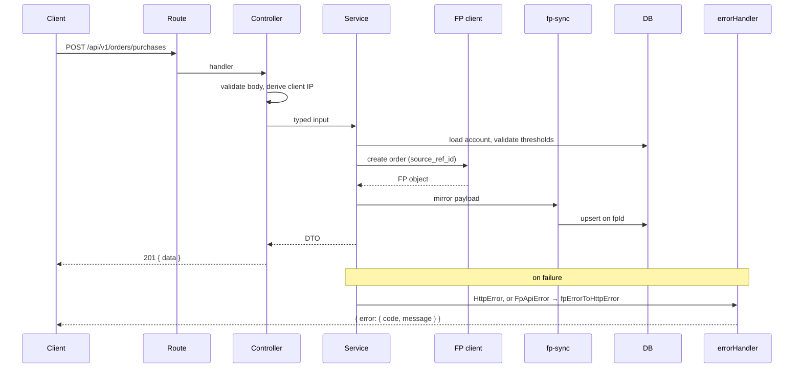
```mermaid
sequenceDiagram
    participant Client
    participant Route
    participant Controller
    participant Service
    participant FP as FP client
    participant Sync as fp-sync
    participant DB
    participant EH as errorHandler

    Client->>Route: POST /api/v1/orders/purchases
    Route->>Controller: handler
    Controller->>Controller: validate body, derive client IP
    Controller->>Service: typed input
    Service->>DB: load account, validate thresholds
    Service->>FP: create order (source_ref_id)
    FP-->>Service: FP object
    Service->>Sync: mirror payload
    Sync->>DB: upsert on fpId
    Service-->>Controller: DTO
    Controller-->>Client: 201 { data }

    Note over Service,EH: on failure
    Service->>EH: HttpError, or FpApiError → fpErrorToHttpError
    EH-->>Client: { error: { code, message } }
```

Responses are always `{ data }` or `{ error: { code, message, ...details } }`.
`errorHandler` is registered **last**; earlier and Express treats it as ordinary
middleware, turning every `HttpError` into a 500 with a stack trace in the body.

### Error mapping

| Cause | Result |
|---|---|
| Invalid input at the controller | `400 BAD_REQUEST` |
| FP returned 400/422 | `400` with FP's field errors forwarded |
| FP returned 404 | `404 NOT_FOUND` |
| FP returned 409 | `409 CONFLICT` |
| FP returned 429 | `429 TOO_MANY_REQUESTS` |
| FP returned 401/403 | `502 BAD_GATEWAY` — our credentials are wrong, not the caller's |
| FP unreachable / timeout | `503 SERVICE_UNAVAILABLE` |
| Prisma P2002 / P2025 / P2034 | `409` / `404` / `409 WRITE_CONFLICT` |
| Anything else | `500`, message withheld |

---

## 4. Schema

46 models, 57 enums. Split by domain below; every relation shown is real.

FP-mirroring enums use value-level `@map`, so the Postgres label is byte
identical to FP's JSON (`'resident_individual'`, not `'RESIDENT_INDIVIDUAL'`).
Enums that are ours alone carry no `@map`.

### 4.1 Identity and access — ours

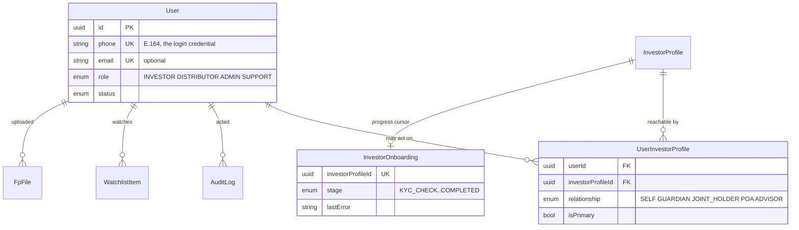
```mermaid
erDiagram
    User ||--o{ UserInvestorProfile : "may act on"
    InvestorProfile ||--o{ UserInvestorProfile : "reachable by"
    InvestorProfile ||--o| InvestorOnboarding : "progress cursor"
    User ||--o{ AuditLog : "acted"
    User ||--o{ WatchlistItem : "watches"
    User ||--o{ FpFile : "uploaded"

    User {
        uuid id PK
        string phone UK "E.164, the login credential"
        string email UK "optional"
        enum role "INVESTOR DISTRIBUTOR ADMIN SUPPORT"
        enum status
    }
    UserInvestorProfile {
        uuid userId FK
        uuid investorProfileId FK
        enum relationship "SELF GUARDIAN JOINT_HOLDER POA ADVISOR"
        bool isPrimary
    }
    InvestorOnboarding {
        uuid investorProfileId UK
        enum stage "KYC_CHECK..COMPLETED"
        string lastError
    }
```

`UserInvestorProfile` is the seam for the **minor** and **joint** subdomains: a
guardian reaching a minor's profile, or a second holder reaching one they do not
own, is a new row with a different `relationship` — not a schema change.

### 4.2 Investor profile and its children — mirror

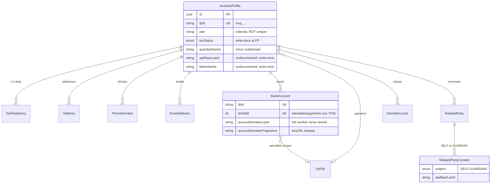
```mermaid
erDiagram
    InvestorProfile ||--o{ TaxResidency : "1-4 slots"
    InvestorProfile ||--o{ Address : "addresses"
    InvestorProfile ||--o{ PhoneNumber : "phones"
    InvestorProfile ||--o{ EmailAddress : "emails"
    InvestorProfile ||--o{ BankAccount : "banks"
    InvestorProfile ||--o{ RelatedParty : "nominees"
    InvestorProfile ||--o{ DematAccount : "demat"
    RelatedParty ||--o{ RelatedPartyContact : "SELF or GUARDIAN"
    BankAccount }o--o| FpFile : "cancelled cheque"
    InvestorProfile }o--o| FpFile : "signature"

    InvestorProfile {
        uuid id PK
        string fpId UK "invp_..."
        string pan "indexed, NOT unique"
        enum taxStatus "write-once at FP"
        string guardianName "minor subdomain"
        string aadhaarLast4 "undocumented, write-once"
        string fatherName "undocumented, write-once"
    }
    BankAccount {
        string fpId UK
        int fpOldId UK "mandates/payments use THIS"
        string accountNumberLast4 "full number never stored"
        string accountNumberFingerprint "sha256, dedupe"
    }
    RelatedPartyContact {
        enum subject "SELF GUARDIAN"
        string aadhaarLast4
    }
```

Notes that matter:
- **PAN is indexed, not unique.** FP lists profiles by PAN and one PAN can carry
  several profiles.
- **The full bank account number is never stored.** FP holds it; we keep the last
  four for display and a SHA-256 fingerprint to recognise a re-entered account.
- `RelatedPartyContact` collapses FP's duplicated `guardian_`-prefixed block into
  one table keyed by `subject` — which makes the minor case a row, not a migration.

### 4.3 Scheme catalogue

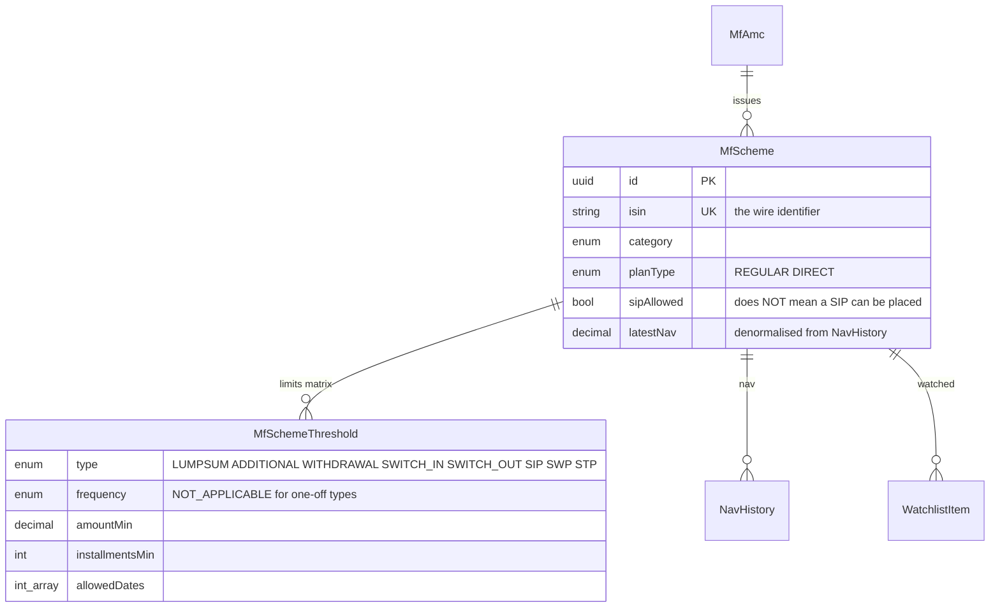
```mermaid
erDiagram
    MfAmc ||--o{ MfScheme : "issues"
    MfScheme ||--o{ MfSchemeThreshold : "limits matrix"
    MfScheme ||--o{ NavHistory : "nav"
    MfScheme ||--o{ WatchlistItem : "watched"

    MfScheme {
        uuid id PK
        string isin UK "the wire identifier"
        enum category
        enum planType "REGULAR DIRECT"
        bool sipAllowed "does NOT mean a SIP can be placed"
        decimal latestNav "denormalised from NavHistory"
    }
    MfSchemeThreshold {
        enum type "LUMPSUM ADDITIONAL WITHDRAWAL SWITCH_IN SWITCH_OUT SIP SWP STP"
        enum frequency "NOT_APPLICABLE for one-off types"
        decimal amountMin
        int installmentsMin
        int_array allowedDates
    }
```

`MfSchemeThreshold.frequency` is NOT NULL with an explicit `NOT_APPLICABLE`
member. That is deliberate: Prisma rejects a null inside a compound-unique
`where`, so a nullable frequency could not be upserted and every catalogue sync
would need a read-then-write.

### 4.4 Investment account, folios, holdings

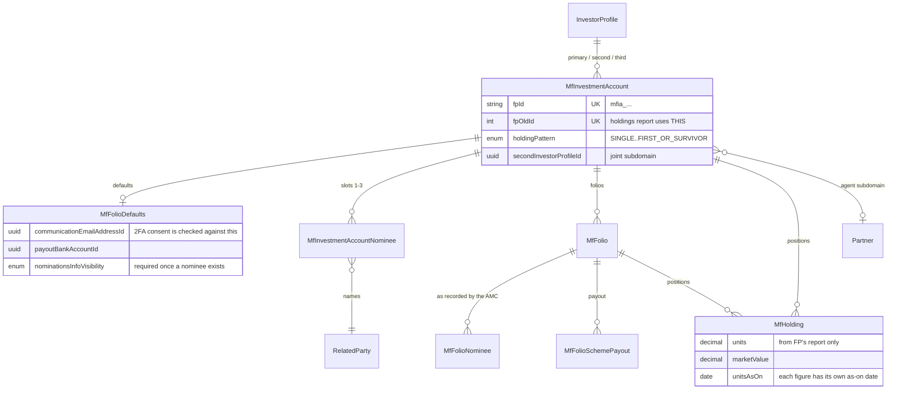
```mermaid
erDiagram
    InvestorProfile ||--o{ MfInvestmentAccount : "primary / second / third"
    MfInvestmentAccount ||--o| MfFolioDefaults : "defaults"
    MfInvestmentAccount ||--o{ MfInvestmentAccountNominee : "slots 1-3"
    MfInvestmentAccountNominee }o--|| RelatedParty : "names"
    MfInvestmentAccount ||--o{ MfFolio : "folios"
    MfInvestmentAccount ||--o{ MfHolding : "positions"
    MfFolio ||--o{ MfFolioNominee : "as recorded by the AMC"
    MfFolio ||--o{ MfFolioSchemePayout : "payout"
    MfFolio ||--o{ MfHolding : "positions"
    MfInvestmentAccount }o--o| Partner : "agent subdomain"

    MfInvestmentAccount {
        string fpId UK "mfia_..."
        int fpOldId UK "holdings report uses THIS"
        enum holdingPattern "SINGLE..FIRST_OR_SURVIVOR"
        uuid secondInvestorProfileId "joint subdomain"
    }
    MfFolioDefaults {
        uuid communicationEmailAddressId "2FA consent is checked against this"
        uuid payoutBankAccountId
        enum nominationsInfoVisibility "required once a nominee exists"
    }
    MfHolding {
        decimal units "from FP's report only"
        decimal marketValue
        date unitsAsOn "each figure has its own as-on date"
    }
```

`MfInvestmentAccountNominee` is what we *asked for*; `MfFolioNominee` is what
the AMC *recorded*. Comparing them is how nomination mismatches get found.

### 4.5 Orders and plans

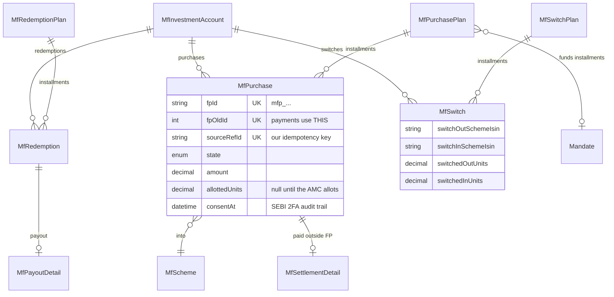
```mermaid
erDiagram
    MfInvestmentAccount ||--o{ MfPurchase : "purchases"
    MfInvestmentAccount ||--o{ MfRedemption : "redemptions"
    MfInvestmentAccount ||--o{ MfSwitch : "switches"
    MfPurchasePlan ||--o{ MfPurchase : "installments"
    MfRedemptionPlan ||--o{ MfRedemption : "installments"
    MfSwitchPlan ||--o{ MfSwitch : "installments"
    MfPurchase ||--o| MfSettlementDetail : "paid outside FP"
    MfRedemption ||--o| MfPayoutDetail : "payout"
    MfPurchasePlan }o--o| Mandate : "funds installments"
    MfPurchase }o--|| MfScheme : "into"

    MfPurchase {
        string fpId UK "mfp_..."
        int fpOldId UK "payments use THIS"
        string sourceRefId UK "our idempotency key"
        enum state
        decimal amount
        decimal allottedUnits "null until the AMC allots"
        datetime consentAt "SEBI 2FA audit trail"
    }
    MfSwitch {
        string switchOutSchemeIsin
        string switchInSchemeIsin
        decimal switchedOutUnits
        decimal switchedInUnits
    }
```

Three order tables rather than one polymorphic table, mirroring FP's three
objects. They share a lifecycle but not their results — a purchase allots units,
a redemption releases them, a switch does both across two schemes.

### 4.6 Payments

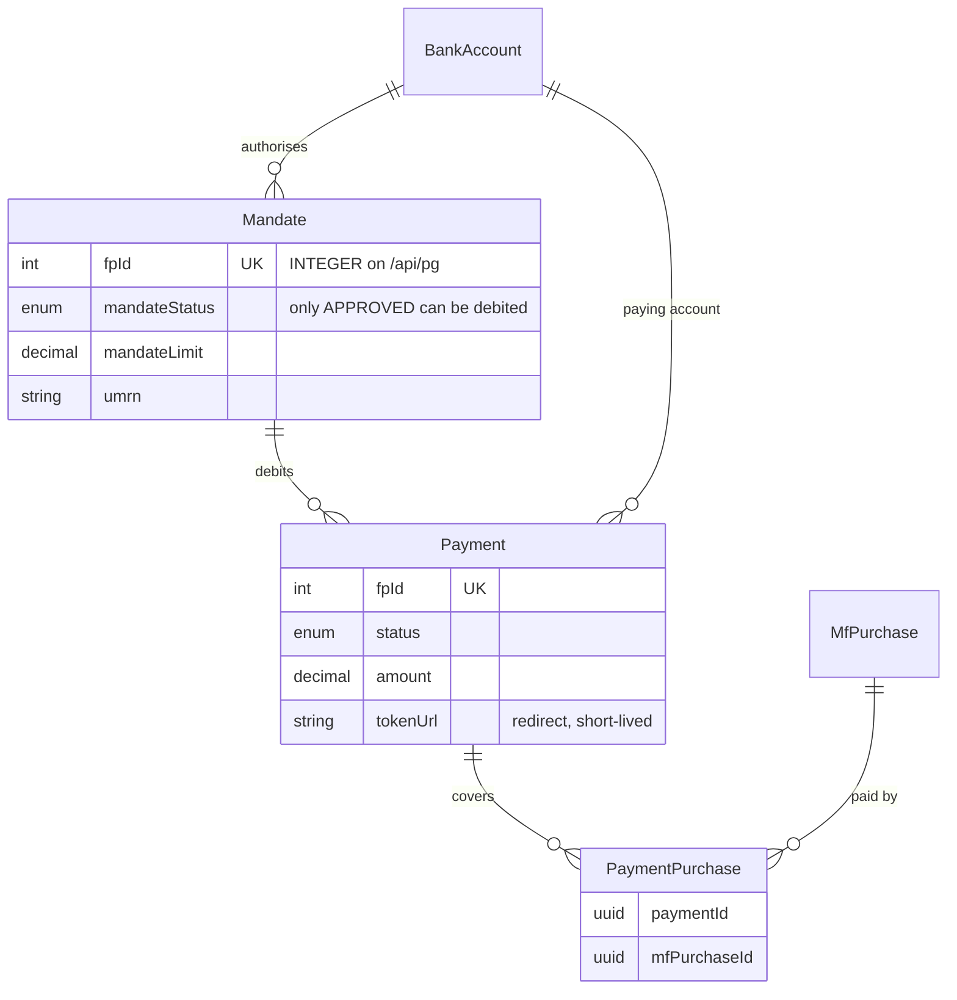
```mermaid
erDiagram
    BankAccount ||--o{ Mandate : "authorises"
    Mandate ||--o{ Payment : "debits"
    Payment ||--o{ PaymentPurchase : "covers"
    MfPurchase ||--o{ PaymentPurchase : "paid by"
    BankAccount ||--o{ Payment : "paying account"

    Mandate {
        int fpId UK "INTEGER on /api/pg"
        enum mandateStatus "only APPROVED can be debited"
        decimal mandateLimit
        string umrn
    }
    Payment {
        int fpId UK
        enum status
        decimal amount
        string tokenUrl "redirect, short-lived"
    }
    PaymentPurchase {
        uuid paymentId
        uuid mfPurchaseId
    }
```

`PaymentPurchase` is many-to-many because FP's `amc_order_ids` is a list: one
netbanking redirect can settle up to ten orders, and a retried order can be paid
by a second payment after the first failed. It is also what stops us charging
twice — FP performs no such check.

### 4.7 KYC and operations

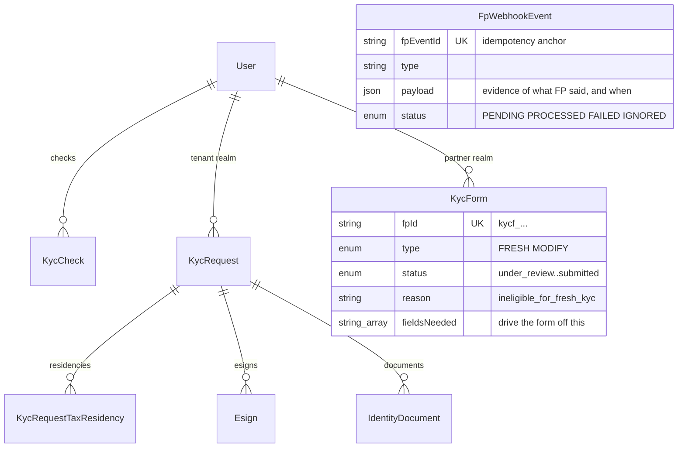
```mermaid
erDiagram
    User ||--o{ KycCheck : "checks"
    User ||--o{ KycRequest : "tenant realm"
    User ||--o{ KycForm : "partner realm"
    KycRequest ||--o{ KycRequestTaxResidency : "residencies"
    KycRequest ||--o{ Esign : "esigns"
    KycRequest ||--o{ IdentityDocument : "documents"

    KycForm {
        string fpId UK "kycf_..."
        enum type "FRESH MODIFY"
        enum status "under_review..submitted"
        string reason "ineligible_for_fresh_kyc"
        string_array fieldsNeeded "drive the form off this"
    }
    FpWebhookEvent {
        string fpEventId UK "idempotency anchor"
        string type
        json payload "evidence of what FP said, and when"
        enum status "PENDING PROCESSED FAILED IGNORED"
    }
```

`KycRequest` and `KycForm` are **two different APIs on two realms**, not
duplicates. A deployment uses whichever it is provisioned for.

---

## 5. API flows

### 5.1 Onboarding

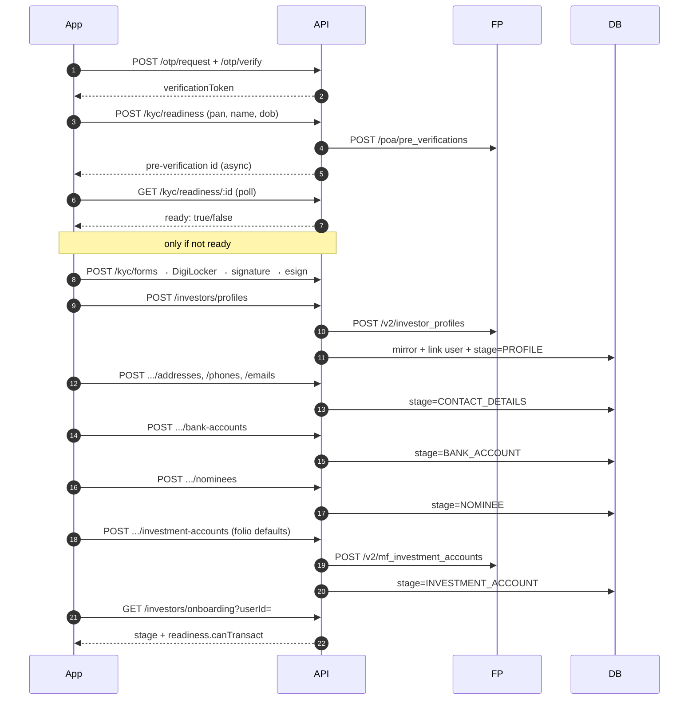
```mermaid
sequenceDiagram
    autonumber
    participant App
    participant API
    participant FP
    participant DB

    App->>API: POST /otp/request + /otp/verify
    API-->>App: verificationToken

    App->>API: POST /kyc/readiness (pan, name, dob)
    API->>FP: POST /poa/pre_verifications
    API-->>App: pre-verification id (async)
    App->>API: GET /kyc/readiness/:id (poll)
    API-->>App: ready: true/false

    Note over App,API: only if not ready
    App->>API: POST /kyc/forms → DigiLocker → signature → esign

    App->>API: POST /investors/profiles
    API->>FP: POST /v2/investor_profiles
    API->>DB: mirror + link user + stage=PROFILE

    App->>API: POST .../addresses, /phones, /emails
    API->>DB: stage=CONTACT_DETAILS
    App->>API: POST .../bank-accounts
    API->>DB: stage=BANK_ACCOUNT
    App->>API: POST .../nominees
    API->>DB: stage=NOMINEE

    App->>API: POST .../investment-accounts (folio defaults)
    API->>FP: POST /v2/mf_investment_accounts
    API->>DB: stage=INVESTMENT_ACCOUNT

    App->>API: GET /investors/onboarding?userId=
    API-->>App: stage + readiness.canTransact
```

`InvestorOnboarding.stage` is a **cursor for the UI, never an authority**.
`canTransact` is computed from the underlying rows, because it gates money.

### 5.2 Purchase

The platform runs on the **cybrillapoa** gateway (FP's ONDC implementation) and
only that gateway. `FP_ORDER_GATEWAY` accepts no other value, so the sequence
below is the only one — it is never left to FP's tenant default, which would
silently produce orders this code cannot progress.

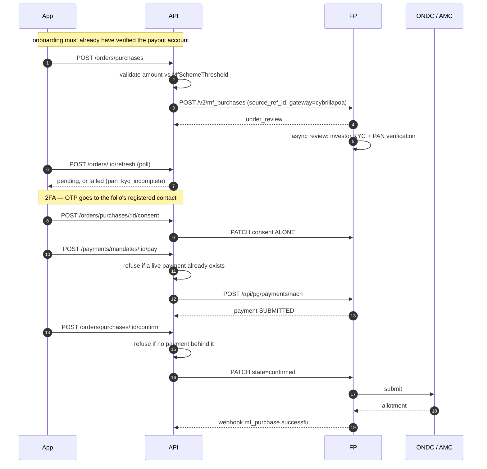
```mermaid
sequenceDiagram
    autonumber
    participant App
    participant API
    participant FP
    participant AMC as ONDC / AMC

    Note over App,API: onboarding must already have verified the payout account
    App->>API: POST /orders/purchases
    API->>API: validate amount vs MfSchemeThreshold
    API->>FP: POST /v2/mf_purchases (source_ref_id, gateway=cybrillapoa)
    FP-->>API: under_review

    FP->>FP: async review: investor KYC + PAN verification
    App->>API: POST /orders/:id/refresh (poll)
    API-->>App: pending, or failed (pan_kyc_incomplete)

    Note over App,API: 2FA — OTP goes to the folio's registered contact
    App->>API: POST /orders/purchases/:id/consent
    API->>FP: PATCH consent ALONE

    App->>API: POST /payments/mandates/:id/pay
    API->>API: refuse if a live payment already exists
    API->>FP: POST /api/pg/payments/nach
    FP-->>API: payment SUBMITTED

    App->>API: POST /orders/purchases/:id/confirm
    API->>API: refuse if no payment behind it
    API->>FP: PATCH state=confirmed
    FP->>AMC: submit
    AMC-->>FP: allotment
    FP-->>API: webhook mf_purchase.successful
```

What this route is:

| | cybrillapoa (ONDC) |
|---|---|
| Initial state | `under_review`, then reviewed asynchronously |
| Settlement details | not applicable — the transport blocks the path |
| Mandate provider | `CYBRILLAPOA` on `/api/pg/mandates` |
| Payment provider | `ONDC` on `/api/pg/payments/*` — *not* the same string |
| Payout account | **must pass bank verification** before submission |
| Cancel | allowed while pending with no payment in flight |
| Simulation | amount ending 0 auto-succeeds, 1 auto-fails |

Why each guard exists:

| Guard | If you skip it |
|---|---|
| `source_ref_id` on create | A retried POST places a **second order** — FP's create is not idempotent |
| Consent PATCHed alone | FP rejects `state` + `consent` together |
| Payment before confirm | FP refuses the confirm; we refuse locally first, naming the gateway |
| Bank verification at onboarding | The order is reviewed, **paid for** and confirmed, then fails at submission with `payout_account_verification_pending` — after the money moved |
| Per-path provider name | Each half of `/api/pg` rejects the other half's name for the same gateway |
| Explicit gateway | FP's tenant default produces orders this code cannot progress |

### 5.3 SIP

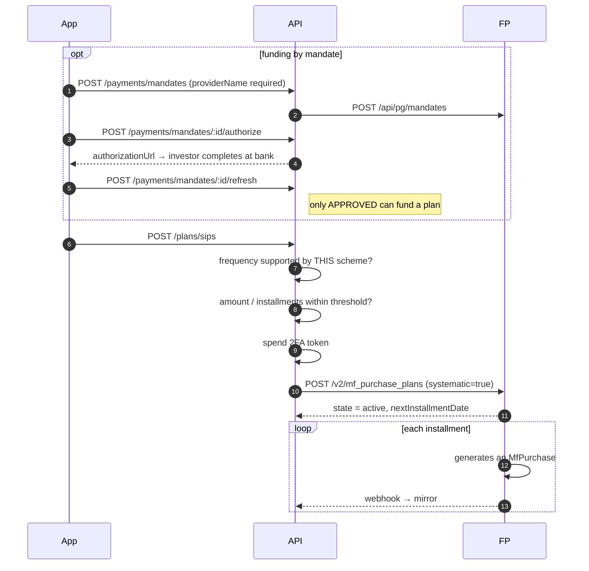
```mermaid
sequenceDiagram
    autonumber
    participant App
    participant API
    participant FP

    opt funding by mandate
        App->>API: POST /payments/mandates (providerName required)
        API->>FP: POST /api/pg/mandates
        App->>API: POST /payments/mandates/:id/authorize
        API-->>App: authorizationUrl → investor completes at bank
        App->>API: POST /payments/mandates/:id/refresh
        Note right of API: only APPROVED can fund a plan
    end

    App->>API: POST /plans/sips
    API->>API: frequency supported by THIS scheme?
    API->>API: amount / installments within threshold?
    API->>API: spend 2FA token
    API->>FP: POST /v2/mf_purchase_plans (systematic=true)
    FP-->>API: state = active, nextInstallmentDate
    loop each installment
        FP->>FP: generates an MfPurchase
        FP-->>API: webhook → mirror
    end
```

`sipAllowed: true` does **not** mean a SIP can be placed — a scheme can publish
zero frequencies (both index funds in the test set do). `scheme-rules.service.ts`
checks the local threshold rows and returns the frequencies the scheme really
offers, instead of letting FP answer *"selected frequency is not supported"*
after the investor has picked an amount and a date.

### 5.4 Webhooks

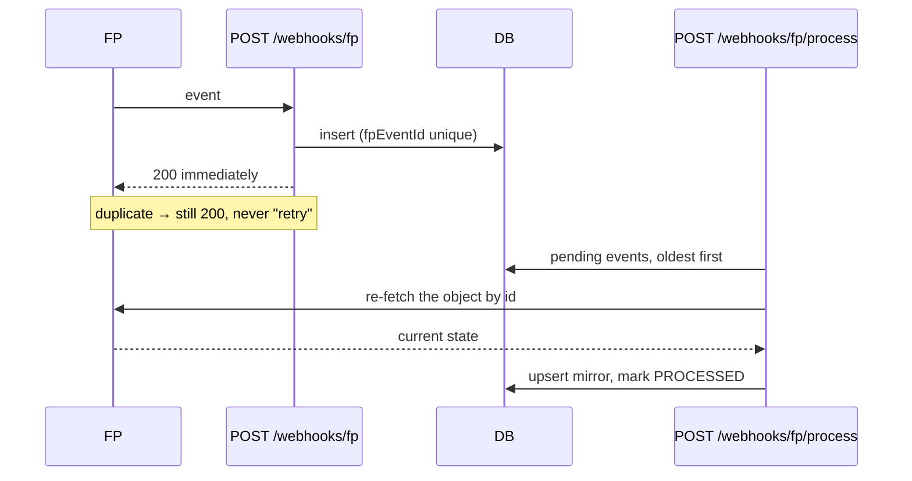
```mermaid
sequenceDiagram
    participant FP
    participant API as POST /webhooks/fp
    participant DB
    participant Worker as POST /webhooks/fp/process

    FP->>API: event
    API->>DB: insert (fpEventId unique)
    API-->>FP: 200 immediately
    Note over API,FP: duplicate → still 200, never "retry"

    Worker->>DB: pending events, oldest first
    Worker->>FP: re-fetch the object by id
    FP-->>Worker: current state
    Worker->>DB: upsert mirror, mark PROCESSED
```

Two deliberate choices:

- **Acknowledge before working.** A handler that does the work inline will
  eventually exceed FP's delivery timeout, and FP will redeliver — multiplying
  load exactly when the system is already struggling.
- **Re-fetch rather than trust the body.** Deliveries arrive out of order; a
  `successful` can land before the `submitted` that preceded it, and applying a
  stale body would walk the mirror backwards.

FP does not sign its webhooks, so nothing in the body is trusted beyond the
event id.

---

## 6. State machines

### Order

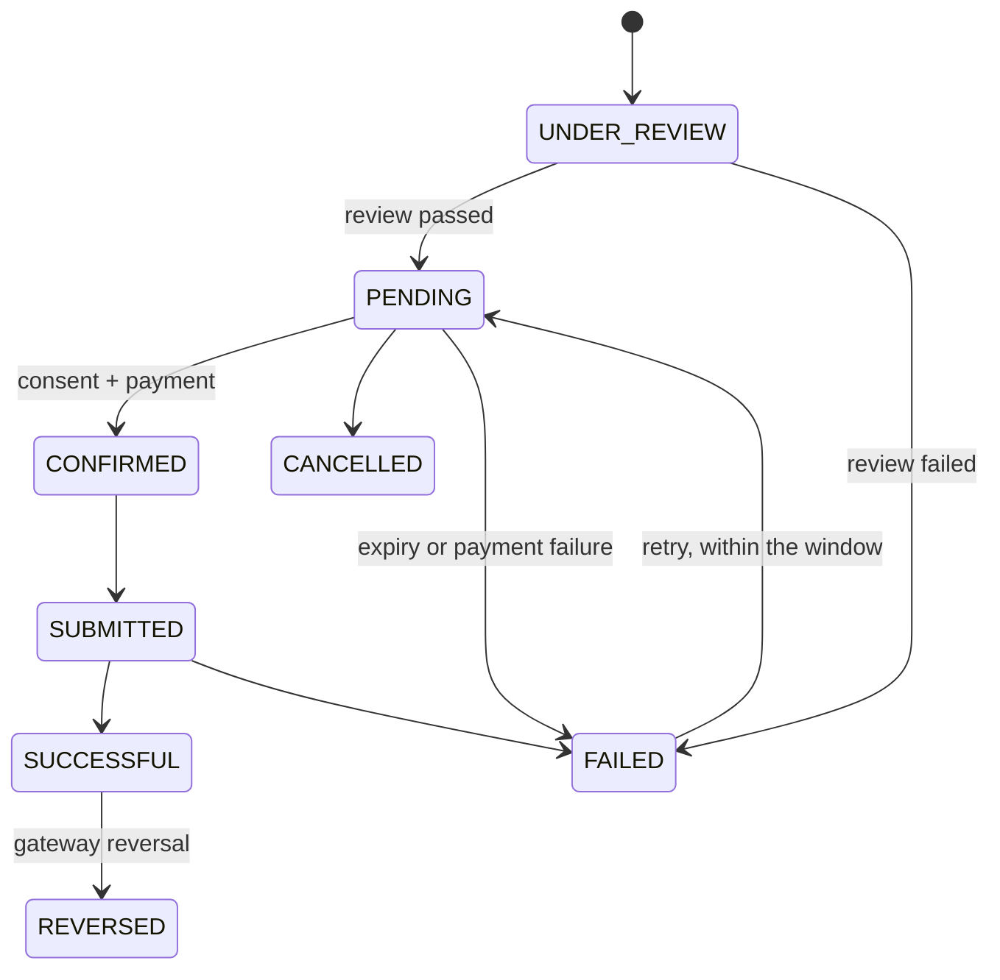
```mermaid
stateDiagram-v2
    [*] --> UNDER_REVIEW
    UNDER_REVIEW --> PENDING : review passed
    UNDER_REVIEW --> FAILED : review failed
    PENDING --> CONFIRMED : consent + payment
    PENDING --> CANCELLED
    PENDING --> FAILED : expiry or payment failure
    CONFIRMED --> SUBMITTED
    SUBMITTED --> SUCCESSFUL
    SUBMITTED --> FAILED
    SUCCESSFUL --> REVERSED : gateway reversal
    FAILED --> PENDING : retry, within the window
```

Expiry: purchase T+7 working days, redemption and switch T+1, counted from
`scheduledOn`. It surfaces as `FAILED` with `failureCode = order_expiry`.

### Plan

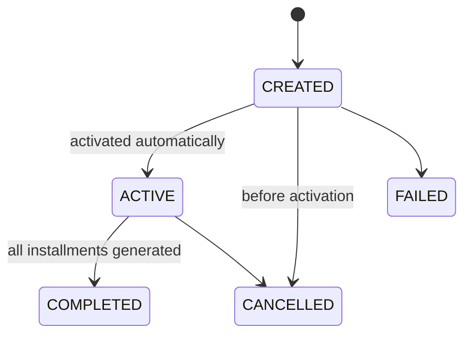
```mermaid
stateDiagram-v2
    [*] --> CREATED
    CREATED --> ACTIVE : activated automatically
    CREATED --> CANCELLED : before activation
    CREATED --> FAILED
    ACTIVE --> COMPLETED : all installments generated
    ACTIVE --> CANCELLED
```

Cancelling does not touch installments already generated — they are orders in
their own right. A cancelled plan can never be reactivated.

### Mandate

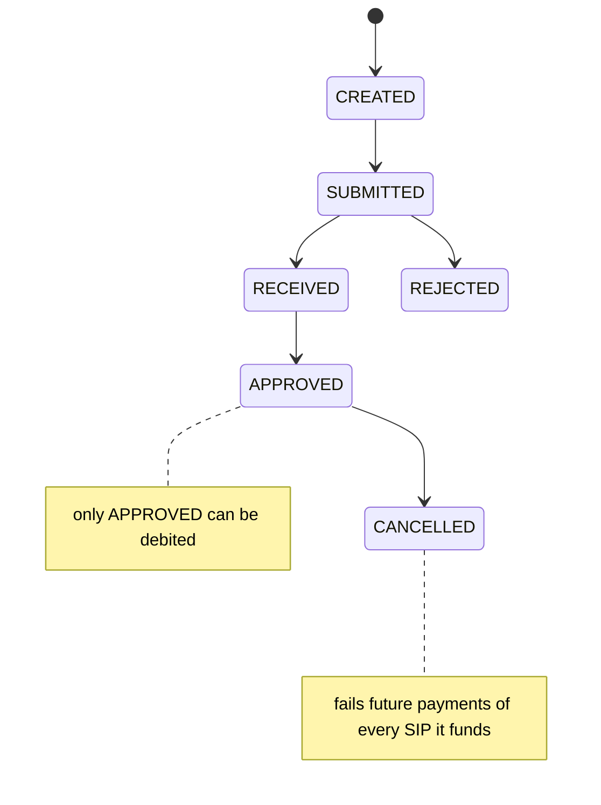
```mermaid
stateDiagram-v2
    [*] --> CREATED
    CREATED --> SUBMITTED
    SUBMITTED --> RECEIVED
    RECEIVED --> APPROVED
    SUBMITTED --> REJECTED
    APPROVED --> CANCELLED
    note right of APPROVED : only APPROVED can be debited
    note right of CANCELLED : fails future payments of every SIP it funds
```

---

## 7. Consistency and safety

| Concern | Mechanism |
|---|---|
| Duplicate order | `sourceRefId`, unique at FP across all three order types |
| Duplicate webhook | `FpWebhookEvent.fpEventId` unique; `createMany(skipDuplicates)` |
| Double payment | `PaymentPurchase` checked for a live payment before creating another — FP does not check |
| Duplicate KYC form | One in-flight form per PAN, enforced before calling FP |
| Token stampede | Single-flight token cache; one refresh serves a concurrent burst |
| Retried write | Retry is **GET-only** by default; a retried POST could place a second order |
| Rate limit (25/s sandbox) | Jittered exponential backoff honouring `Retry-After` |
| Stale mirror | `syncedAt` per row; webhook backlog endpoint for operators |
| Money precision | `Decimal` everywhere, strings across the API boundary, never `Float` |
| PII | Full bank numbers never stored; Aadhaar last 4 only; PAN masked in responses |

---

## 8. Endpoints

```
GET    /health

GET    /api/v1/schemes                            catalogue, cursor-paginated
GET    /api/v1/schemes/:isin                      limits and thresholds
GET    /api/v1/schemes/:isin/nav

POST   /api/v1/otp/request  |  /otp/verify        phone verification

POST   /api/v1/kyc/readiness                      can this PAN transact?
GET    /api/v1/kyc/readiness/:id                  poll (asynchronous)
POST   /api/v1/kyc/forms                          start digital KYC
GET    /api/v1/kyc/forms/:id   PATCH /:id         fill in fieldsNeeded
POST   /api/v1/kyc/forms/:id/refresh              poll (no webhooks on this realm)
POST   /api/v1/kyc/forms/:id/retry-proof

POST   /api/v1/investors/profiles
GET    /api/v1/investors/profiles?userId=
GET    /api/v1/investors/onboarding?userId=       resume a half-finished signup
POST   /api/v1/investors/profiles/:id/addresses
POST   /api/v1/investors/profiles/:id/phones
POST   /api/v1/investors/profiles/:id/emails
POST   /api/v1/investors/profiles/:id/bank-accounts
POST   /api/v1/investors/profiles/:id/nominees
POST   /api/v1/investors/profiles/:id/investment-accounts
GET    /api/v1/investors/investment-accounts/:id
PATCH  /api/v1/investors/investment-accounts/:id/folio-defaults

POST   /api/v1/orders/purchases                   → /consent → payment → /confirm
POST   /api/v1/orders/purchases/:id/retry | /cancel
POST   /api/v1/orders/redemptions                 → /confirm
POST   /api/v1/orders/switches                    → /confirm
GET    /api/v1/orders?mfInvestmentAccountId=
GET    /api/v1/orders/:id
POST   /api/v1/orders/:id/refresh

POST   /api/v1/plans/sips | /swps | /stps
GET    /api/v1/plans?mfInvestmentAccountId=
GET    /api/v1/plans/:id
POST   /api/v1/plans/:id/cancel

POST   /api/v1/payments/mandates
GET    /api/v1/payments/mandates?investorProfileId=
GET    /api/v1/payments/mandates/:id
POST   /api/v1/payments/mandates/:id/authorize | /refresh | /cancel | /pay
POST   /api/v1/payments/netbanking
GET    /api/v1/payments/:id
POST   /api/v1/payments/:id/refresh

GET    /api/v1/portfolio/:accountId/summary
GET    /api/v1/portfolio/:accountId/holdings
GET    /api/v1/portfolio/:accountId/folios
GET    /api/v1/portfolio/:accountId/returns
GET    /api/v1/portfolio/:accountId/capital-gains
POST   /api/v1/portfolio/:accountId/refresh

POST   /api/v1/webhooks/fp                        FP posts here
POST   /api/v1/webhooks/fp/process                operator, x-admin-secret
GET    /api/v1/webhooks/fp/backlog                operator, x-admin-secret
```

---

## 9. Not done

- Webhook subscriptions are not registered — needs a public URL.
  `FP_WEBHOOK_EVENTS` lists what to subscribe to.
- `POST /webhooks/fp/process` is called by hand; it should be scheduled.
- Catalogue sync runs from the seed snapshot, not on a schedule.
- Authentication exists (bearer session, per-parameter ownership, idempotent
  writes, per-IP limits) but is not finished for the internet: no `helmet`/
  `cors`, and the rate limit is in-process rather than at the edge.
- Blocked by sandbox provisioning, not by code, and each verified by
  `bun run test:e2e`:
  - no payment provider on the ONDC route — `POST /api/pg/payments/netbanking`
    answers `422 NO_PAYMENT_PROVIDER`, *"Provider ONDC not configured"*, so
    payment collection and the confirm that needs it cannot complete;
  - the POA penny-drop never returns a verdict, so a payout account cannot be
    verified (`FP_REQUIRE_PAYOUT_ACCOUNT_VERIFICATION=false` is the sandbox-only
    escape hatch);
  - KYC-form eligibility refuses every PAN with `ineligible_for_fresh_kyc`.
